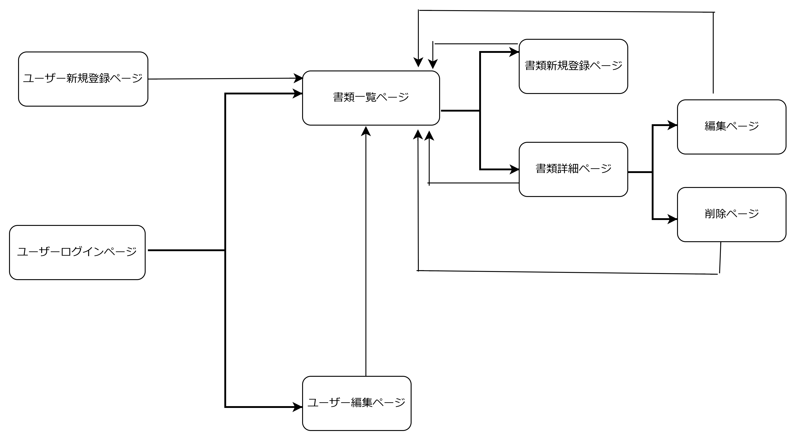

## アプリケーション名
Filesync

## アプリケーション概要

このプロジェクトは書類管理システムです。ユーザーは書類を管理し、各書類の詳細情報を保存し、返却物件を管理できます。

## 利用方法
#書類登録・編集機能z
・営業担当者が入力する書類の詳細情報（顧客名、種類、受領日、手続き日）
・不備の有無、手続きの進捗等進捗状況を更新しステータス管理（不備、確認中、完了）
# チャット機能
書類に不備があった際に、営業担当者と事務担当者がやり取り可能。
# カレンダー機能
・書類の手続き希望日ごとに視覚的に一覧表示
# 返却状況の記録
返却物の状態（保管中、返却済）の記録
# ユーザー管理（営業担当者、事務担当者、管理者）
営業担当者
・書類をお客様から受け取り、事務担当者に渡す役割
・不備がある場合のやり取りに関与
・処理済返却物を管理
事務担当者
・書類を確認し、内容に不備がないか確認
・不備があれば営業担当者に連絡
・不備のない状態であれば手続きを行う
管理者
・全体の進捗や状況をモニタリングし、必要に応じて調整

## アプリケーションを作成した背景
現職で使用しているシステムは、営業担当者からの預かった書類の処理希望日が1日分のみ入力できる仕組みにでです。窓口の来客数は、時期や天候によっても大きく変わり、予測が難しいです。処理希望日に幅を持たせることが可能であれば、窓口の来客者数が少ない日には余裕があるため手続きを進めることもでき、業務効率化が図れると考えました。また、現在不備項目は、付箋や口頭で伝えたりと、当事者同士でしかわからないことが現状です。当事者間以外でも不備事項についてのやりとりがわかりやすく記録に残せるようにチャット機能をつけました。

## データベース設計

## 画面遷移図

### Usersテーブル

| カラム名           | データ型 | 制約        |
|-------------------|----------|------------|
| user_id           | integer  | PK         |
| user_name         | string   | null: false|
| encrypted_password| string   | null: false|
| created_at        | datetime |            |
| updated_at        | datetime |            |

### Association

- has_many :documents
- has_many :comments
- has_many :returns

### Documentsテーブル

| カラム名          | データ型 | 制約                           |
|------------------|----------|-------------------------------|
| document_id      | integer  | PK                            |
| category_id      | integer  | null: false, foreign_key: true|
| quantity         | integer  | null: false                   |
| received_date    | date     | null: false                   |
| customer_name    | string   | null: false                   |
| processing_dates | json     | null: false                   |
| user_id          | integer  | null: false, foreign_key: true|
| created_at       | datetime |                               |
| updated_at       | datetime |                               |

### Association
- has_many :returns
- belongs_to :category
- belongs_to :user
- belongs_to :status

### Commentsテーブル

| カラム名       | データ型   | 制約                            |
|---------------|------------|--------------------------------|
| comment_id    | integer    | PK                             |
| text          | string     | null: false                    |
| user_id       | integer    | null: false, foreign_key: true |
| document_id   | integer    | null: false, foreign_key: true |
| created_at    | datetime   |                                |
| updated_at    | datetime   |                                |

### Association
- belongs_to :user
- belongs_to :document

### Returnsテーブル

| カラム名        | データ型 | 制約                          |
|----------------|----------|--------------------------------|
| return_id      | integer  | PK                             |
| processed_date | date     | null: false                    |
| category_id    | integer  | null: false, foreign_key: true |
| quantity       | integer  | null: false                    |
| user_id        | integer  | null: false, foreign_key: true |
| return_due_date| date     | null: false                    |
| created_at     | datetime |                                |
| updated_at     | datetime |                                |

### Association
- belongs_to :document
- belongs_to :category
- belongs_to :user

### Categoriesテーブル

| カラム名      | データ型  | 制約                           |
|--------------|------------|--------------------------------|
| category_id  | integer    | PK                             |
| category_name| string     | null: false                    |
| created_at   | datetime   |                                |
| updated_at   | datetime   |                                |

### Association
- has_many :documents
- has_many :returns